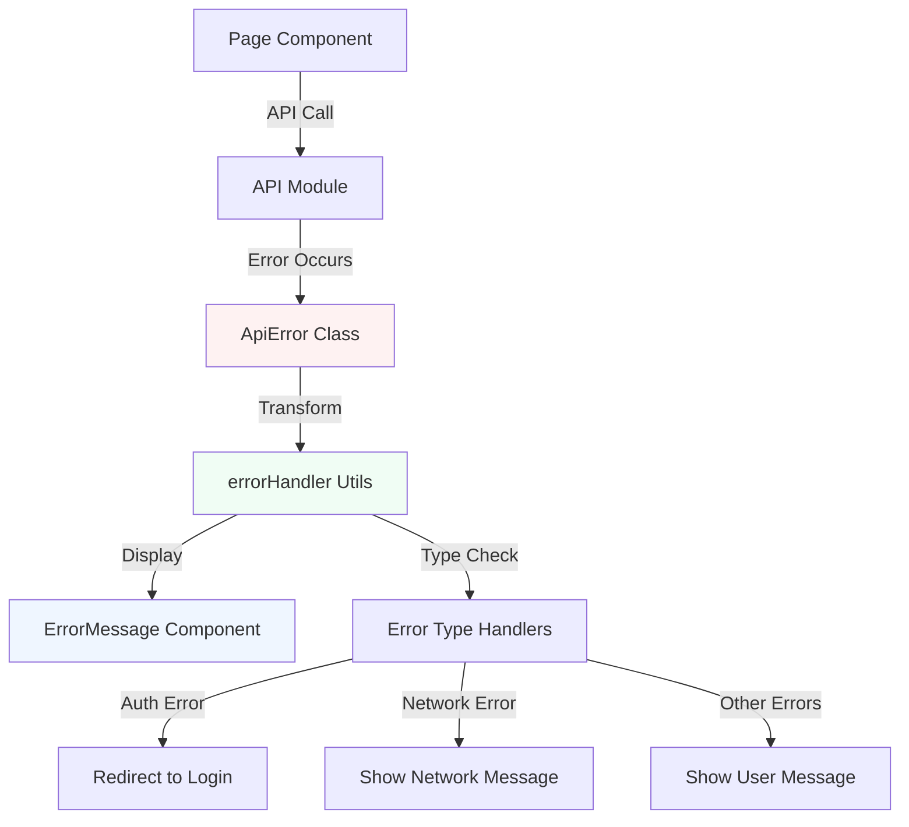

# Design Document: Frontend Error Handling Rollout

## Overview

This design document outlines the systematic application of structured error handling to the remaining 9 pages and 1 context in the Harang school management system frontend. The error handling infrastructure (ApiError class, error utilities, ErrorMessage component) is already implemented and proven effective in login, signup, schedule pages, and AuthContext. This rollout ensures consistent, user-friendly error handling across the entire application.

## Architecture



## Main Workflow

```mermaid
sequenceDiagram
    participant Page as Page Component
    participant API as API Module
    participant Handler as Error Handler
    participant UI as ErrorMessage Component
    
    Page->>API: API call (e.g., getData())
    API-->>Page: Error thrown (ApiError)
    Page->>Handler: getErrorMessage(error)
    Handler-->>Page: User-friendly message
    Page->>Page: setError(message)
    Page->>UI: Render ErrorMessage
    UI-->>Page: Display error to user


## Core Interfaces/Types

```typescript
// Error state management in components
interface PageErrorState {
  error: unknown | null
  setError: (error: unknown | null) => void
}

// API error structure (already implemented)
class ApiError extends Error {
  constructor(
    public statusCode: number,
    public message: string,
    public details?: any
  )
}

// Error handler utilities (already implemented)
interface ErrorHandlerUtils {
  getErrorMessage: (error: unknown) => string
  formatErrorDetails: (error: unknown) => string[]
  isAuthError: (error: unknown) => boolean
  isPermissionError: (error: unknown) => boolean
  isNetworkError: (error: unknown) => boolean
}

// ErrorMessage component props (already implemented)
interface ErrorMessageProps {
  error: unknown
  className?: string
}
```


## Key Functions with Formal Specifications

### Function 1: handleApiError()

```typescript
function handleApiError(
  error: unknown,
  setError: (error: unknown) => void,
  options?: {
    onAuthError?: () => void
    onNetworkError?: () => void
  }
): void
```

**Preconditions:**
- `error` is defined (may be any type)
- `setError` is a valid state setter function
- `options` is optional configuration object

**Postconditions:**
- Error state is updated with the error object
- If auth error and `onAuthError` provided, callback is executed
- If network error and `onNetworkError` provided, callback is executed
- No side effects beyond state update and optional callbacks

**Loop Invariants:** N/A (no loops)

### Function 2: clearError()

```typescript
function clearError(setError: (error: unknown) => void): void
```

**Preconditions:**
- `setError` is a valid state setter function

**Postconditions:**
- Error state is set to null
- Component re-renders without error display

**Loop Invariants:** N/A (no loops)


## Algorithmic Pseudocode

### Main Error Handling Algorithm

```pascal
ALGORITHM handlePageError(error, setError, router)
INPUT: error of type unknown, setError function, router object
OUTPUT: void (side effects: state update, possible navigation)

BEGIN
  // Step 1: Update error state
  setError(error)
  
  // Step 2: Check error type and handle accordingly
  IF isAuthError(error) THEN
    // Clear auth state and redirect to login
    logout()
    router.push('/login')
    RETURN
  END IF
  
  IF isNetworkError(error) THEN
    // Network errors are already set, just display
    // User will see "서버에 연결할 수 없습니다."
    RETURN
  END IF
  
  // Step 3: For other errors, state is already set
  // ErrorMessage component will display it
END
```

**Preconditions:**
- error parameter exists (may be any type)
- setError is a valid React state setter
- router is Next.js router instance

**Postconditions:**
- Error state is updated
- If auth error: user is logged out and redirected
- If network error: error message is displayed
- For other errors: appropriate message is displayed

**Loop Invariants:** N/A (no loops)


### Data Loading with Error Handling Algorithm

```pascal
ALGORITHM loadDataWithErrorHandling(apiCall, setData, setError, setLoading)
INPUT: apiCall function, setData function, setError function, setLoading function
OUTPUT: void (side effects: state updates)

BEGIN
  // Step 1: Set loading state
  setLoading(true)
  
  // Step 2: Clear previous errors
  setError(null)
  
  // Step 3: Attempt API call
  TRY
    data ← AWAIT apiCall()
    setData(data)
    setError(null)  // Ensure error is cleared on success
  CATCH error
    setError(error)
    // Data remains unchanged (previous data or initial state)
  FINALLY
    setLoading(false)
  END TRY
END
```

**Preconditions:**
- apiCall is an async function that returns data or throws error
- All setter functions are valid React state setters
- Component is mounted

**Postconditions:**
- Loading state is false
- If successful: data is updated, error is null
- If failed: error is set, data is unchanged
- Loading state is always set to false (via finally block)

**Loop Invariants:** N/A (no loops)


### Form Submission with Error Handling Algorithm

```pascal
ALGORITHM submitFormWithErrorHandling(formData, apiCall, setError, onSuccess)
INPUT: formData object, apiCall function, setError function, onSuccess callback
OUTPUT: void (side effects: state updates, navigation)

BEGIN
  // Step 1: Clear previous errors
  setError(null)
  
  // Step 2: Validate form data (client-side)
  IF NOT isValidFormData(formData) THEN
    setError("입력 데이터를 확인해주세요.")
    RETURN
  END IF
  
  // Step 3: Attempt API call
  TRY
    result ← AWAIT apiCall(formData)
    setError(null)
    onSuccess(result)
  CATCH error
    setError(error)
    // Form remains in current state for user to correct
  END TRY
END
```

**Preconditions:**
- formData contains all required fields
- apiCall is an async function
- setError is a valid state setter
- onSuccess is a callback function

**Postconditions:**
- If successful: onSuccess is called, error is null
- If validation fails: error message is set, API not called
- If API fails: error is set, form state unchanged
- User can retry after seeing error

**Loop Invariants:** N/A (no loops)


## Example Usage

### Example 1: Basic Data Loading (Dashboard, Grades, Notifications)

```typescript
'use client'
import { useState, useEffect } from 'react'
import { gradesApi, GradeOut } from '@/lib/api'
import ErrorMessage from '@/components/ErrorMessage'

export default function GradesPage() {
  const [grades, setGrades] = useState<GradeOut[]>([])
  const [loading, setLoading] = useState(true)
  const [error, setError] = useState<unknown>(null)

  useEffect(() => {
    async function loadGrades() {
      try {
        const data = await gradesApi.mine()
        setGrades(data)
        setError(null)
      } catch (err) {
        setError(err)
      } finally {
        setLoading(false)
      }
    }
    loadGrades()
  }, [])

  if (loading) return <div>Loading...</div>

  return (
    <div>
      {error && <ErrorMessage error={error} className="mb-4" />}
      {/* Rest of component */}
    </div>
  )
}
```


### Example 2: Form Submission (QnA, Announcements)

```typescript
'use client'
import { useState } from 'react'
import { qnaApi } from '@/lib/api'
import ErrorMessage from '@/components/ErrorMessage'
import { getErrorMessage } from '@/lib/errorHandler'

export default function QnAPage() {
  const [error, setError] = useState<unknown>(null)
  const [submitting, setSubmitting] = useState(false)

  const handleCreate = async () => {
    if (!title.trim() || !content.trim()) {
      setError(new Error('제목과 내용을 입력해주세요.'))
      return
    }

    setSubmitting(true)
    setError(null)

    try {
      const post = await qnaApi.create({ title, content, subject })
      setPosts(prev => [post, ...prev])
      setShowNew(false)
      // Reset form
    } catch (err) {
      setError(err)
    } finally {
      setSubmitting(false)
    }
  }

  return (
    <div>
      {error && <ErrorMessage error={error} className="mb-4" />}
      <button onClick={handleCreate} disabled={submitting}>
        {submitting ? '등록 중...' : '질문 등록'}
      </button>
    </div>
  )
}
```


### Example 3: Multiple API Calls (Dashboard)

```typescript
'use client'
import { useState, useEffect } from 'react'
import { announcementsApi, assignmentsApi, scheduleApi } from '@/lib/api'
import ErrorMessage from '@/components/ErrorMessage'

export default function DashboardPage() {
  const [error, setError] = useState<unknown>(null)
  const [announcements, setAnnouncements] = useState([])
  const [assignments, setAssignments] = useState([])
  const [schedule, setSchedule] = useState([])

  useEffect(() => {
    async function loadDashboardData() {
      try {
        const [anns, asns, sched] = await Promise.all([
          announcementsApi.list().catch(() => []),
          assignmentsApi.list().catch(() => []),
          scheduleApi.timetable().catch(() => [])
        ])
        setAnnouncements(anns)
        setAssignments(asns)
        setSchedule(sched)
        setError(null)
      } catch (err) {
        setError(err)
      }
    }
    loadDashboardData()
  }, [])

  return (
    <div>
      {error && <ErrorMessage error={error} className="mb-4" />}
      {/* Dashboard content */}
    </div>
  )
}
```


### Example 4: Context with Error Handling (ChatContext)

```typescript
'use client'
import { createContext, useState, useEffect } from 'react'
import { chatApi } from '@/lib/api'
import { getErrorMessage } from '@/lib/errorHandler'

interface ChatContextType {
  rooms: RoomOut[]
  error: unknown | null
  sendMessage: (roomId: number, content: string) => Promise<void>
}

export const ChatContext = createContext<ChatContextType | undefined>(undefined)

export function ChatProvider({ children }: { children: React.ReactNode }) {
  const [rooms, setRooms] = useState<RoomOut[]>([])
  const [error, setError] = useState<unknown>(null)

  useEffect(() => {
    async function loadRooms() {
      try {
        const data = await chatApi.getRooms()
        setRooms(data)
        setError(null)
      } catch (err) {
        setError(err)
        console.error('Failed to load chat rooms:', getErrorMessage(err))
      }
    }
    loadRooms()
  }, [])

  const sendMessage = async (roomId: number, content: string) => {
    try {
      await chatApi.sendMessage(roomId, content)
      setError(null)
    } catch (err) {
      setError(err)
      throw err // Re-throw so component can handle it
    }
  }

  return (
    <ChatContext.Provider value={{ rooms, error, sendMessage }}>
      {children}
    </ChatContext.Provider>
  )
}
```


## Components and Interfaces

### Component 1: Page Components (9 pages)

**Purpose**: Display data and handle user interactions with consistent error handling

**Pages to Update**:
1. `app/chat/page.tsx` - Chat interface
2. `app/dashboard/page.tsx` - Dashboard overview
3. `app/grades/page.tsx` - Student grades
4. `app/notifications/page.tsx` - Notification center
5. `app/qna/page.tsx` - Q&A board
6. `app/announcements/page.tsx` - Announcements
7. `app/assignments/page.tsx` - Assignment management
8. `app/school/page.tsx` - School information
9. `app/settings/page.tsx` - User settings

**Interface**:
```typescript
interface PageComponent {
  // State
  error: unknown | null
  loading: boolean
  data: any[]
  
  // Methods
  loadData: () => Promise<void>
  handleError: (error: unknown) => void
  clearError: () => void
}
```

**Responsibilities**:
- Manage error state alongside data and loading states
- Display ErrorMessage component when error exists
- Clear errors on successful operations
- Handle auth errors by redirecting to login


### Component 2: ChatContext

**Purpose**: Manage chat state and WebSocket connections with error handling

**Interface**:
```typescript
interface ChatContextType {
  rooms: RoomOut[]
  messages: MessageOut[]
  activeId: number | null
  error: unknown | null
  loadingMessages: boolean
  
  setActiveId: (id: number | null) => void
  sendMessage: (roomId: number, content: string) => Promise<void>
  createRoom: (data: CreateRoomInput) => Promise<void>
  deleteRoom: (roomId: number) => Promise<void>
}
```

**Responsibilities**:
- Maintain error state for context-level operations
- Propagate errors to consuming components
- Log errors for debugging
- Allow components to handle errors locally when needed

## Data Models

### Model 1: ErrorState

```typescript
interface ErrorState {
  error: unknown | null
  hasError: boolean
  errorMessage: string
  errorDetails: string[]
}
```

**Validation Rules**:
- `error` can be any type (unknown)
- `hasError` is derived from `error !== null`
- `errorMessage` is computed via `getErrorMessage(error)`
- `errorDetails` is computed via `formatErrorDetails(error)`


### Model 2: PageErrorPattern

```typescript
interface PageErrorPattern {
  // State management
  errorState: unknown | null
  setErrorState: (error: unknown | null) => void
  
  // Error handling strategy
  strategy: 'display' | 'redirect' | 'silent'
  
  // Optional callbacks
  onAuthError?: () => void
  onNetworkError?: () => void
}
```

**Validation Rules**:
- `errorState` must be set via `setErrorState` only
- `strategy` determines how error is handled:
  - `display`: Show ErrorMessage component
  - `redirect`: Navigate to login (auth errors)
  - `silent`: Log only (background operations)
- Callbacks are optional and executed based on error type

## Error Handling Strategies by Page

### Strategy 1: Data Display Pages (Grades, Notifications, School)

**Pattern**: Display errors inline, allow retry

```typescript
// Error display at top of content
{error && <ErrorMessage error={error} className="mb-4" />}

// Retry button (optional)
{error && (
  <button onClick={() => { setError(null); loadData() }}>
    다시 시도
  </button>
)}
```

**Characteristics**:
- Non-blocking: User can still see UI
- Clear error message
- Optional retry mechanism


### Strategy 2: Interactive Pages (QnA, Announcements, Assignments)

**Pattern**: Display errors in modals/forms, prevent submission on error

```typescript
// In modal/form
{error && <ErrorMessage error={error} className="mb-4" />}

// Disable submit button while submitting
<button 
  onClick={handleSubmit} 
  disabled={submitting || !isValid}
>
  {submitting ? '처리 중...' : '제출'}
</button>

// Clear error on input change
<input 
  onChange={(e) => {
    setValue(e.target.value)
    setError(null) // Clear error when user types
  }}
/>
```

**Characteristics**:
- Inline feedback in forms
- Clear error before retry
- Prevent duplicate submissions

### Strategy 3: Real-time Pages (Chat, Dashboard)

**Pattern**: Display errors without blocking real-time updates

```typescript
// Non-intrusive error display
{error && (
  <div className="error-banner">
    <ErrorMessage error={error} />
    <button onClick={() => setError(null)}>×</button>
  </div>
)}

// Continue showing cached data
{messages.map(msg => <Message key={msg.id} {...msg} />)}
```

**Characteristics**:
- Show error but keep UI functional
- Allow dismissal
- Preserve existing data


### Strategy 4: Settings Page

**Pattern**: Validate before submit, show specific field errors

```typescript
// Field-level validation
const validateSettings = (data: SettingsData): string | null => {
  if (!data.email) return '이메일을 입력해주세요.'
  if (!data.name) return '이름을 입력해주세요.'
  return null
}

// Handle submission
const handleSave = async () => {
  const validationError = validateSettings(formData)
  if (validationError) {
    setError(new Error(validationError))
    return
  }

  try {
    await settingsApi.update(formData)
    setError(null)
    showSuccessMessage()
  } catch (err) {
    setError(err)
  }
}
```

**Characteristics**:
- Client-side validation first
- Server-side validation errors displayed
- Success feedback on save

## Correctness Properties

### Property 1: Error State Consistency

```typescript
// Universal quantification: For all API calls
∀ apiCall ∈ APIOperations:
  (apiCall succeeds ⟹ error === null) ∧
  (apiCall fails ⟹ error !== null)
```

**Meaning**: Error state accurately reflects API operation status


### Property 2: Error Message User-Friendliness

```typescript
// Universal quantification: For all errors displayed
∀ error ∈ DisplayedErrors:
  getErrorMessage(error) is in Korean ∧
  getErrorMessage(error) is user-friendly ∧
  getErrorMessage(error).length > 0
```

**Meaning**: All error messages are localized and understandable

### Property 3: Auth Error Handling

```typescript
// Universal quantification: For all 401 errors
∀ error ∈ APIErrors:
  (error.statusCode === 401) ⟹ 
    (user is logged out ∧ redirected to /login)
```

**Meaning**: Authentication errors always trigger logout and redirect

### Property 4: Error Clearing

```typescript
// Universal quantification: For all successful operations
∀ operation ∈ UserActions:
  (operation succeeds) ⟹ (error is set to null)
```

**Meaning**: Successful operations clear previous errors

### Property 5: Loading State Consistency

```typescript
// Universal quantification: For all async operations
∀ asyncOp ∈ AsyncOperations:
  (asyncOp starts ⟹ loading === true) ∧
  (asyncOp completes ⟹ loading === false)
```

**Meaning**: Loading state is always properly managed


## Error Handling Scenarios

### Scenario 1: Network Failure

**Condition**: Server is unreachable or network is down
**Response**: 
- Display "서버에 연결할 수 없습니다." message
- Keep existing data visible if available
- Provide retry option

**Recovery**:
- User clicks retry button
- Or page auto-retries after network restoration

### Scenario 2: Authentication Expired

**Condition**: JWT token expired (401 error)
**Response**:
- Clear user session
- Redirect to /login page
- Show "로그인이 필요합니다." message

**Recovery**:
- User logs in again
- Redirected back to original page (if possible)

### Scenario 3: Validation Error

**Condition**: Form data fails server validation (422 error)
**Response**:
- Display field-specific errors
- Highlight invalid fields
- Keep form data intact

**Recovery**:
- User corrects invalid fields
- Resubmits form

### Scenario 4: Permission Denied

**Condition**: User lacks permission for action (403 error)
**Response**:
- Display "권한이 없습니다." message
- Disable action button
- Explain required permission level

**Recovery**:
- User contacts admin for permission
- Or navigates to allowed pages


### Scenario 5: Resource Not Found

**Condition**: Requested resource doesn't exist (404 error)
**Response**:
- Display "요청한 데이터를 찾을 수 없습니다." message
- Show empty state UI
- Provide navigation to valid pages

**Recovery**:
- User navigates to different page
- Or creates new resource if applicable

### Scenario 6: Server Error

**Condition**: Internal server error (500 error)
**Response**:
- Display "서버 오류가 발생했습니다. 잠시 후 다시 시도해주세요." message
- Log error details for debugging
- Provide retry option

**Recovery**:
- User waits and retries
- Or contacts support if persistent

## Testing Strategy

### Unit Testing Approach

**Test Coverage**:
1. Error state management
2. Error message transformation
3. Error type detection
4. Component rendering with errors

**Key Test Cases**:
```typescript
describe('Error Handling', () => {
  it('should set error state on API failure', async () => {
    // Mock API to throw error
    // Call component function
    // Assert error state is set
  })

  it('should clear error on successful retry', async () => {
    // Set initial error state
    // Mock successful API call
    // Call retry function
    // Assert error is null
  })

  it('should display ErrorMessage when error exists', () => {
    // Render component with error
    // Assert ErrorMessage is visible
  })
})
```


### Integration Testing Approach

**Test Scenarios**:
1. End-to-end error flow (API → Component → UI)
2. Auth error redirect flow
3. Form validation error display
4. Network error recovery

**Example Test**:
```typescript
describe('Grades Page Error Handling', () => {
  it('should display error when API fails', async () => {
    // Mock API to return 500 error
    render(<GradesPage />)
    
    // Wait for error to appear
    await waitFor(() => {
      expect(screen.getByText(/서버 오류/)).toBeInTheDocument()
    })
  })

  it('should redirect on auth error', async () => {
    // Mock API to return 401 error
    const mockPush = jest.fn()
    render(<GradesPage />, { router: { push: mockPush } })
    
    // Wait for redirect
    await waitFor(() => {
      expect(mockPush).toHaveBeenCalledWith('/login')
    })
  })
})
```

### Manual Testing Checklist

**For Each Page**:
- [ ] Error displays when API fails
- [ ] Error clears on successful retry
- [ ] Auth errors redirect to login
- [ ] Network errors show appropriate message
- [ ] Validation errors show field details
- [ ] Loading state prevents duplicate requests
- [ ] Error message is in Korean
- [ ] Error message is user-friendly
- [ ] UI remains functional during error display
- [ ] Error can be dismissed (if applicable)


## Performance Considerations

### Optimization 1: Error State Batching

**Issue**: Multiple API calls may fail simultaneously
**Solution**: Batch error updates to prevent multiple re-renders

```typescript
// Instead of setting error for each failed call
Promise.all([
  api1().catch(e => setError(e)),
  api2().catch(e => setError(e)),
  api3().catch(e => setError(e))
])

// Collect errors and set once
const errors = []
await api1().catch(e => errors.push(e))
await api2().catch(e => errors.push(e))
await api3().catch(e => errors.push(e))
if (errors.length > 0) setError(errors[0])
```

### Optimization 2: Error Message Memoization

**Issue**: `getErrorMessage()` called on every render
**Solution**: Memoize error message computation

```typescript
const errorMessage = useMemo(
  () => error ? getErrorMessage(error) : null,
  [error]
)
```

### Optimization 3: Debounced Error Clearing

**Issue**: Rapid input changes trigger multiple error clears
**Solution**: Debounce error clearing on input

```typescript
const debouncedClearError = useMemo(
  () => debounce(() => setError(null), 300),
  []
)

<input onChange={(e) => {
  setValue(e.target.value)
  debouncedClearError()
}} />
```
